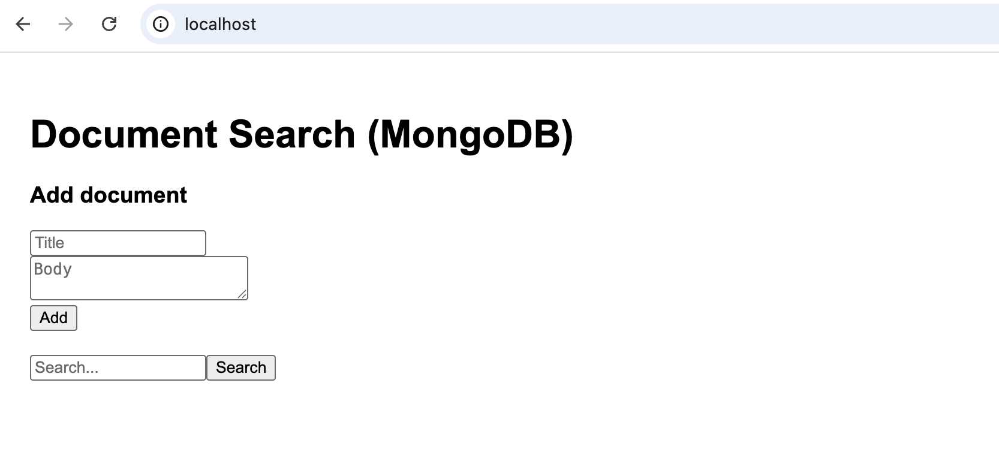
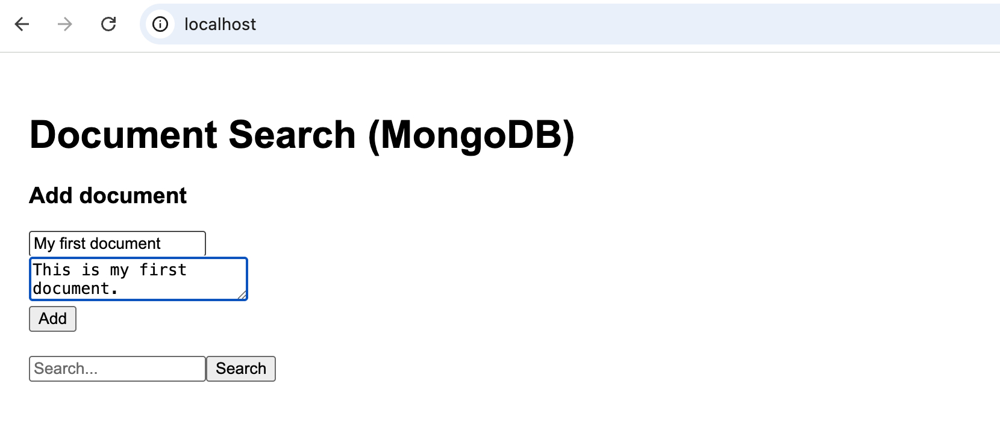
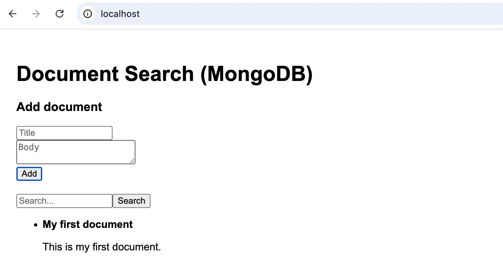
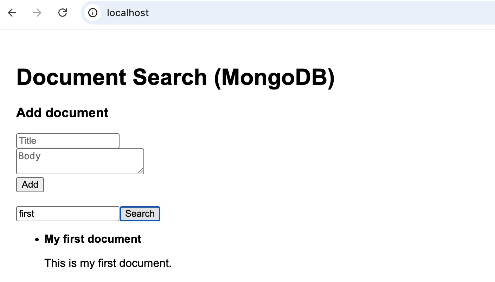

### Document search project

### High level architecture:
* Backend: FastAPI (Python) → connects to MongoDB (stores & searches documents using text index).
* Frontend: React (same simple UI).
* MongoDB: Included as a separate microservice with PersistentVolumeClaim (PVC) in Helm.
* Helm chart: Deploys 3 components → backend, frontend, and mongodb with services + optional ingress.
* Each has its own Dockerfile.

### Build , Tag and push 
```
export DOCKERHUB_USER=<docker-repo-user-name>
docker login -u $DOCKERHUB_USER
docker-compose build
docker-compose push
```

### Values preparation to deploy
```
envsubst < helm-chart/values.yaml > helm-chart/values.tmp.yaml
```

### Deploying into K8S
```
helm install docsearch ./helm-chart -f helm-chart/values.tmp.yaml -n docsearch --create-namespace
```

### Port-forwarding the forntend
```
kubectl -n docsearch port-forward svc/docsearch-frontend 8080:80
```

### Accessing application
* [Backend API](http://docsearch-backend:8000/docs) (This works within the pod).
* [Frontend app](http://localhost:80) (works from browser)
* [MongoDB](http://localhost:27017) (This works within the pod)


### Scrren shorts
* *This is the welcome page*


* *Shows the document being inserted.*


* *Confirmation page after a successful document upload.*


* *Search page displaying indexed documents.*


### Accessing the application using portforward (optional)
```
kubectl -n docsearch port-forward svc/docsearch-frontend 8888:80
```

### Manual verififcation from frond end pod
* Login into frontend pod
```
kubectl exec -it -n docsearch docsearch-frontend-7b4xxx bash
```
* Insert document
```
curl -X POST http://docsearch-backend:8000/documents \
-H "Content-Type: application/json" \
-d '{
  "title": "My first document",
  "body": "This is the content of my first document in MongoDB."
}'
```
* Search a test
```
curl http://docsearch-backend:8000/search?q=test
```

### Cleanup
```
helm delete docsearch --namespace docsearch
kubectl delete ns docsearch
docker rmi $(docker image ls | grep $DOCKERHUB_USER | awk '{print $3}') 
rm helm-chart/values.tmp.yaml
```


